# Devsketch

- [What is DevSketch](#introduction)
- [Getting started](#getting_started)
- [Setting up the workspace](#setting_up)
- [Working with the workspace. ](#working_with)
- [Visual Map](#visual_map)
- [Adding an object](#adding_object)
- [Deleting](#deleting)
- [Expand and collapse](#expand_collapse)
- [The Heat Map or What are those Circles?](#heatmap)
- [Orphan Inspector: All about orphans](#orphan_inspector)
- [Refactoring](#refactoring)
- [Adding Tests](#adding_tests)
- [Code Output](#code_output)
- [Analysing an existing project.](#analysing)

## What is DevSketch

DevSketch is a tool for Swift and Objective-C developers. Its good for prototyping components and analysing existing code bases. 

## Getting started 

Create a new document. You can choose from 4 preset sets of SDK's or just carry on by clicking the close button.

## Setting up the workspace

You can configure the workspace in a couple of places. 

### Application level preferences 

Select **DevSketch > Preferences…**

This window allows you to pick which Xcode you are using. 

You can tell DevSketch who you are:  

How you'd like your headers to be generated:

### Document Level Preferences

Select **Document > Edit Document Settings…**

Here you can add or remove SDKs and give the project a name. 

If you are generating Objective-C code you can add a prefix to all type names. 

## Working with the workspace. 

### Main window

The document window has 3 sections. 

#### Libraries on the left.

This is where you find objects you have created or objects from the SDK's that your project contains. 

#### Visual Map in the center.

This is visual map of your objects and its relationships to other objects. An object can exist in the library but not be visible on the map. 

#### Inspectors on the right.

The inspectors tell you about the selected object (or objects). 

You can collapse or expand the left and right sections by: 

- dragging the vertical split.
- using the key shortcuts CMD+0 for the left, CMD+ALT+0 for the right.

## Visual Map 

This contains a representation of the objects in your workspace. 

### Adding an object

Double click on the map to add a new *Class* object. 

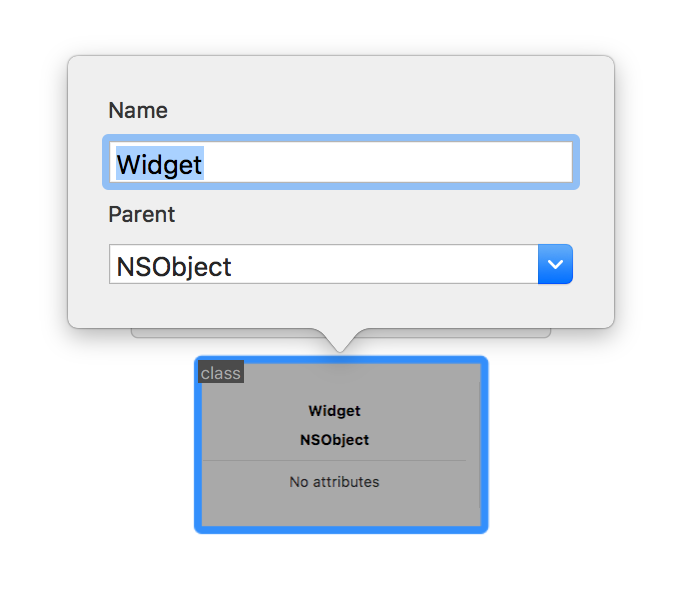

Right click on the map and select from the menu to add any other kind of object. 

- Protocol

- Struct 
 
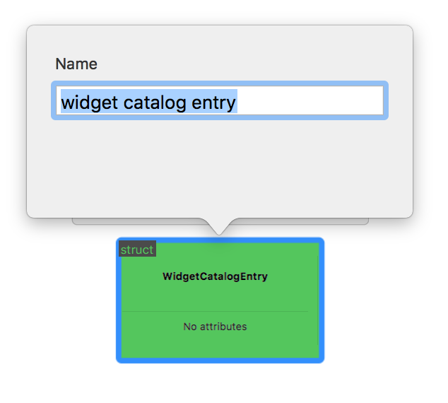

- You may convert from class to struct (or struct to class) by right-clicking the object. 
- Objective-C does not support code generation for structs.

- Enumeration

- Extension

#### Editing an object

- Double click the object to edit the name and parent.

 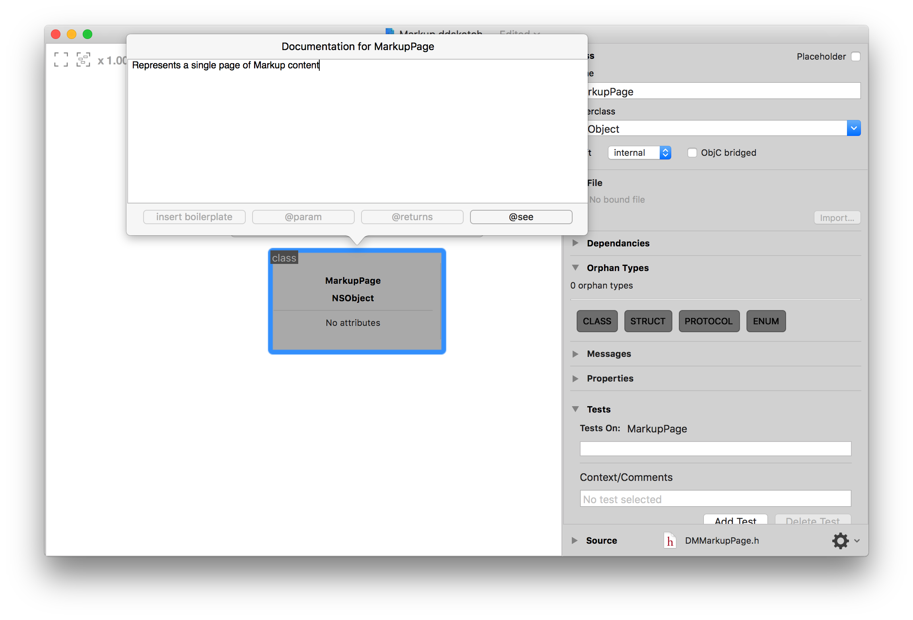
 
 - Double click the documentation panel (ALT+Space) to edit the description.

#### Deleting 

- Delete the object from the map with the Delete key. (**Edit > Delete from view**)The object will still be in the database. 
- Delete the object from the database with ALT+Delete (ALT + **Edit > Delete from database**) 

#### Adding a property

Select the object and press CMD+L (**Object > Add Property**) 

- You can enter the name in spaced language and that will be converted to Camel-Case e.g *"page number"* becomes *pageNumber*
- You can enter the type Swift-style with a colon *name:type* or just fill in the Type field. 

Click **Add** to commit the addition.

You can edit the property: 
 
- In the right hand inspector.
- By double-clicking the property on the map.  

#### Adding a method 

Select the object and press CMD+M (**Object > Add Method**)

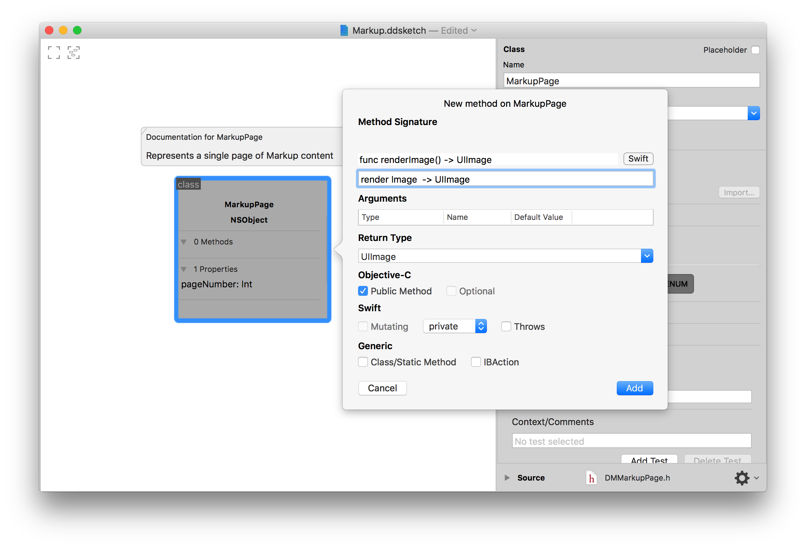

- You can enter the message in Swift like format. DevSketch will do its best to figure out what you want. 
- Spaced signatures will get Camel-Cased. 
- Use **(** to start arguments composition.  
- Use **->** to start return type description.

e.g 

- *do this(foo*  becomes *func doThis(foo: Any)*
- *do that -> Thing* becomes *func doThat() -> Thing*
- *look at that(foo: Bar) Baz* becomes *lookAtThat(foo: Bar) -> Baz*
- *render image( completion:(UIImage)->()* becomes *renderImage( completion:(UIImage) -> ())*

You can edit the method: 

- in the right hand inspector
- by double-clicking the method on the map. 

![Double click method] 

#### Expand and collapse

The map representation of an object can be collapsed or expanded. 
  
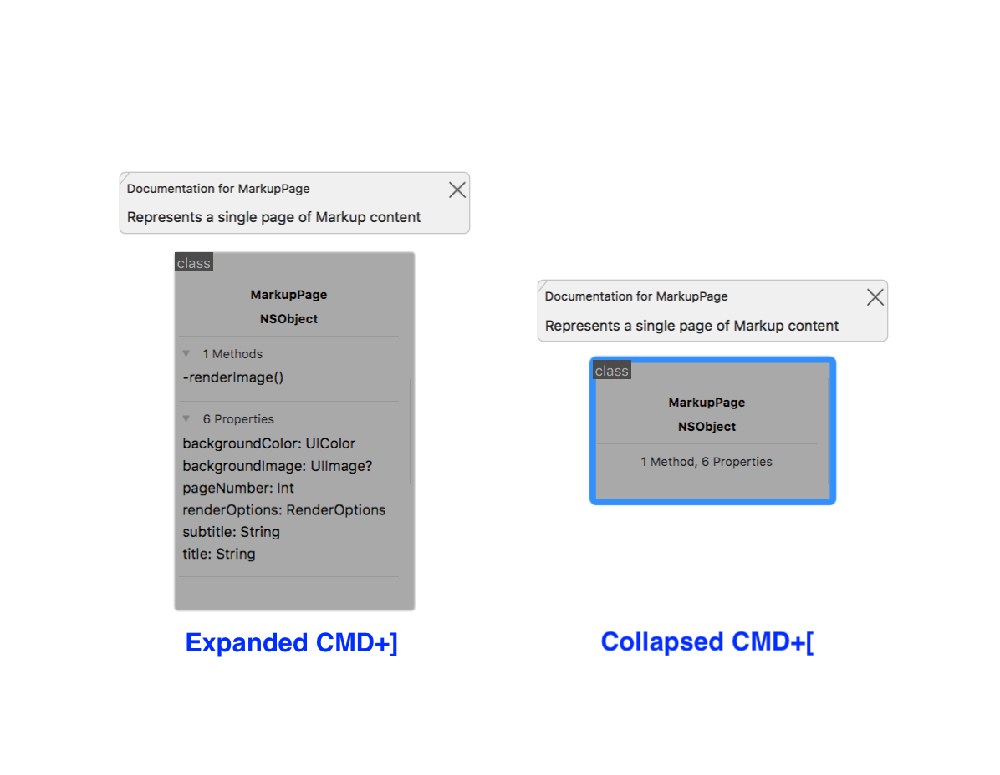

- Use CMD+[ to collapse (**Object > Collapse Representation**)
- Use CMD+] to expand (**Object > Expand Representation**)

Expanded representations will hide the table at smaller magnifications.

### The Heat Map or What are those Circles?

You can see that there are circles around your objects. This is the heat map.

It shows the relative density of connections to an object. It allows you to see from a distance what objects are important or overused within a code base 

Denser colors mean that this object has relatively more connections than others. 

You can change the colors in the preferences panel. **DevSketch > Preferences…**

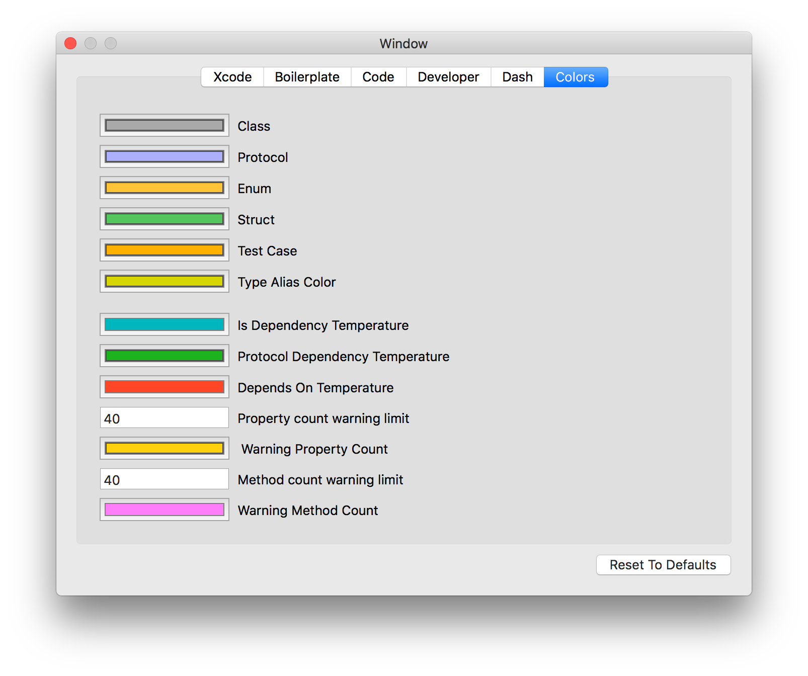

If you don't want to see the heat map use **View > Hide Heat Map**

### Orphan Inspector: All about orphans

DevSketch will examine your object definition and look for types that don't exist in your database or the imported SDK's.

What this means is you can declare a type ahead of time:

- Declare *RenderOptions* as a type.

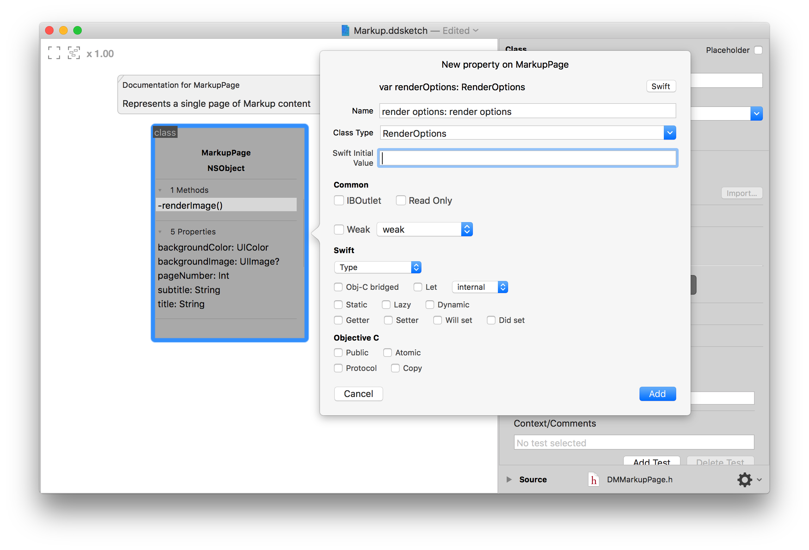

- *RenderOptions* appears as an orphan type. Drag a object type to the map to create. 

- Start defining what *RenderOptions* should do and what attributes it should have.

The **Orphan Inspector** allows you to be flexible in your design and naming. If you are not sure what an object should be named or if it should even exist you can delay creation till you are ready. 

## Refactoring

While you are working you will inevitably discover points where you want to change the design. 

#### Create an adopted protocol.

- *You decide that a markup page should be represented by a protocol. You need refactor some of the attributes of* **MarkupPage** *out.*

1. Hold down *ALT* and drag away from the origin object.
2. Release the mouse where you want to place your new object.
3. Select what object type you want to create from the menu.

- Create a protocol called **PageDescription**

#### Move the attributes you want to shift to the protocol.

Expand the source object (CMD+]) if you haven't already. 

Select the attributes you want to move. You can pick multiple items with the SHIFT or CMD modifiers.

There are two ways to move attributes from one object to another. 

1. Standard Cut/Copy/Paste with the keyboard or menus. 
2. Drag from source to destination. This is always a *Copy* operation. 

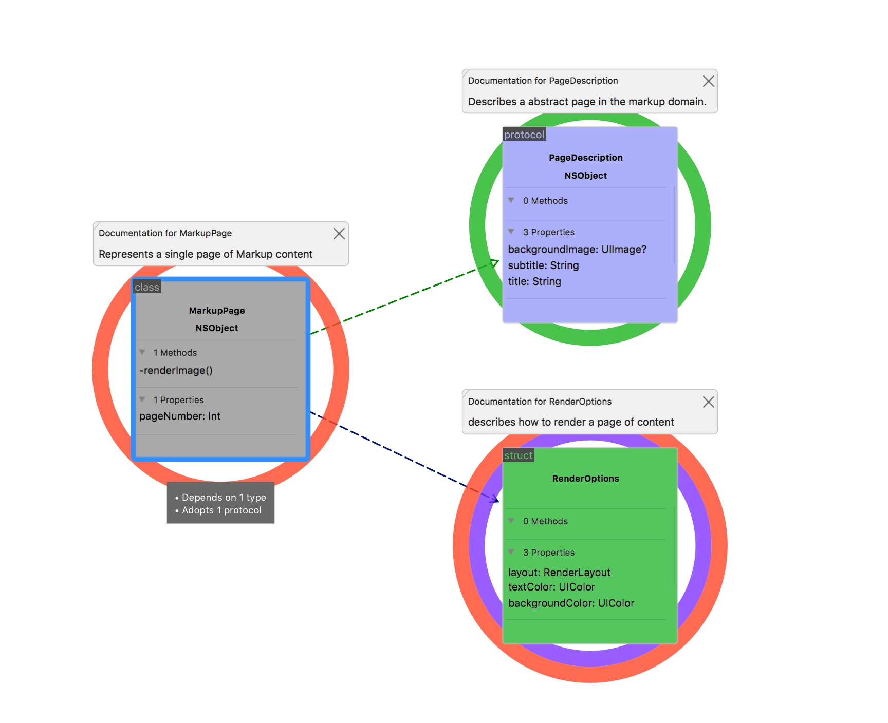

- *You think that it's strange that page should have the responsibility of rendering itself. Why not move that functionality to a new class.*

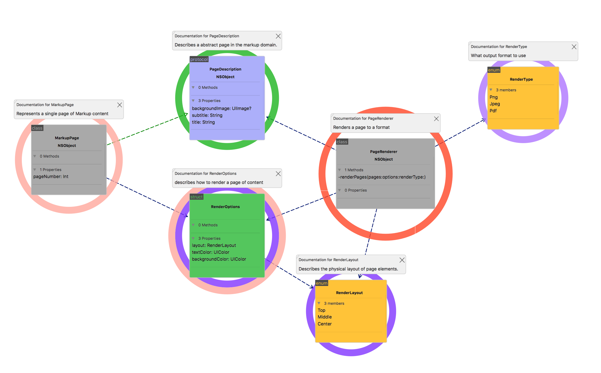

### Adding Tests

All good code deserves tests. DevSketch allows you to define the tests. 

- *You take a look at the structure and figure out that the only thing that needs tests is* **PageRenderer**. *The other classes are containers.*

Select the object you want to add tests to and press **CMD+T** (Object > Add Test)

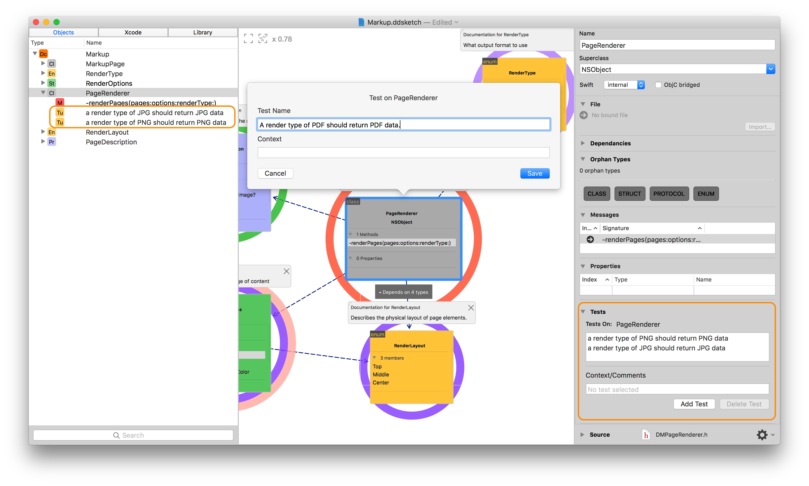

## Code Output

Once you have sorted out how you want your system to work its time to generate code. 

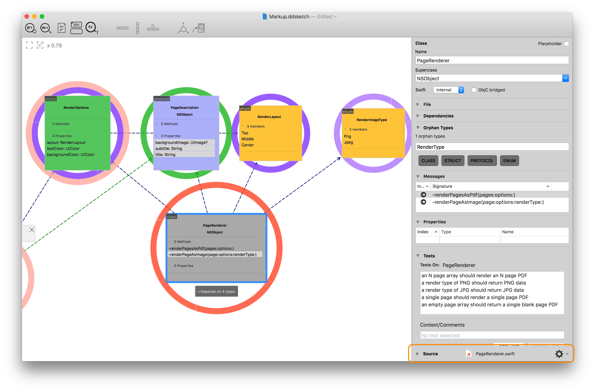

This isn't finished code as you may need to make decisions about return values. Placeholders are left so that you do this where needed.

DevSketch offers several ways to get your code into your project. 

### Individual files

The **Source Viewer** is at the base of the right hand inspector. You can shrink it away when you aren't using it. 

You can choose to create code stubs in *Swift* or *Objective-C*

- Copy to the pasteboard. 
- Save the file. 
- Drag the file proxy icon to the Xcode project tree or Finder. 

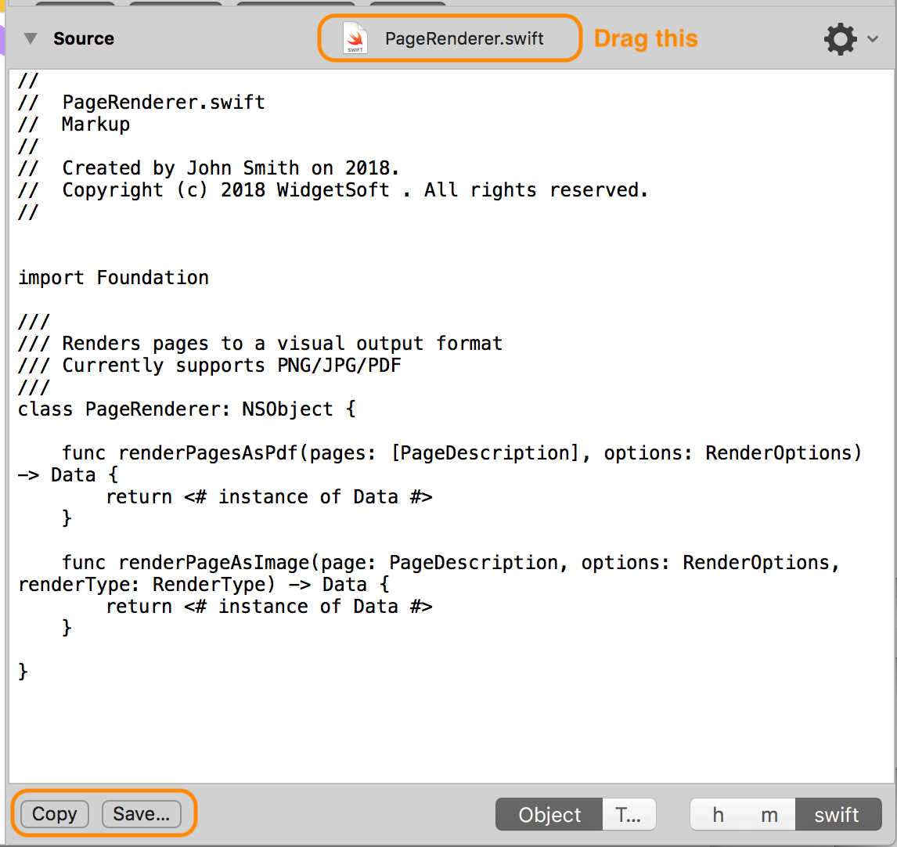

You can create either object or test code. 

When dragging a file to Xcode remember:

- Tick **Copy files if needed**
- Tick a **Target** to add your files to.

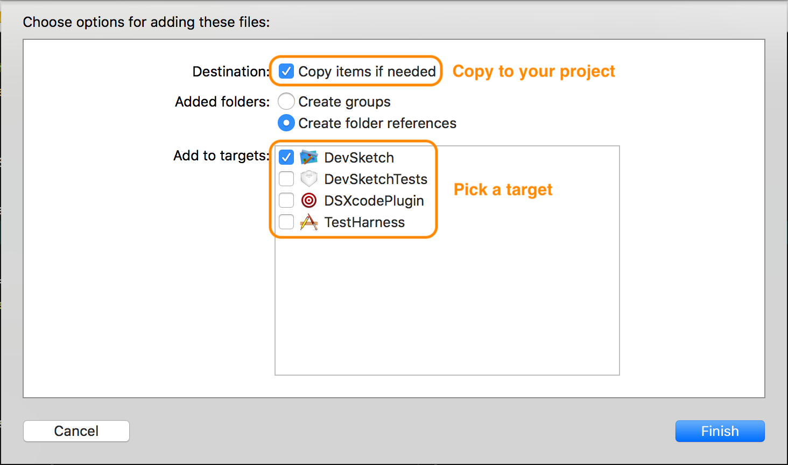

### Bulk export 

You can export many objects at the same time.

**WARNING. This operation can overwrite files in your project. Make sure you are using source control**

Use **Document > Export All…**

## Analysing an existing project. 

The other thing that DevSketch will do is analyse an existing project or single files.

There are two ways to get files into DevSketch. 

### Dragging individual files onto the map 

Drag a file direct from the Xcode project explorer and any of the other proxies that are provided. Or drag from anywhere in macOS.

### Import an Xcode project

Ideally create a new document with the appropriate SDK set. Or just import into an existing project. You might be getting a lot of new content. 

*The sample will look at an open source vector editor called [Inkpad](https://github.com/sprang/Inkpad).*

Open the Xcode tab in the left hand inspector.

Choose the folder that contains the **.xcodeproj** file. An import window will appear.

Pick the folders and files you want to import. Press Import.

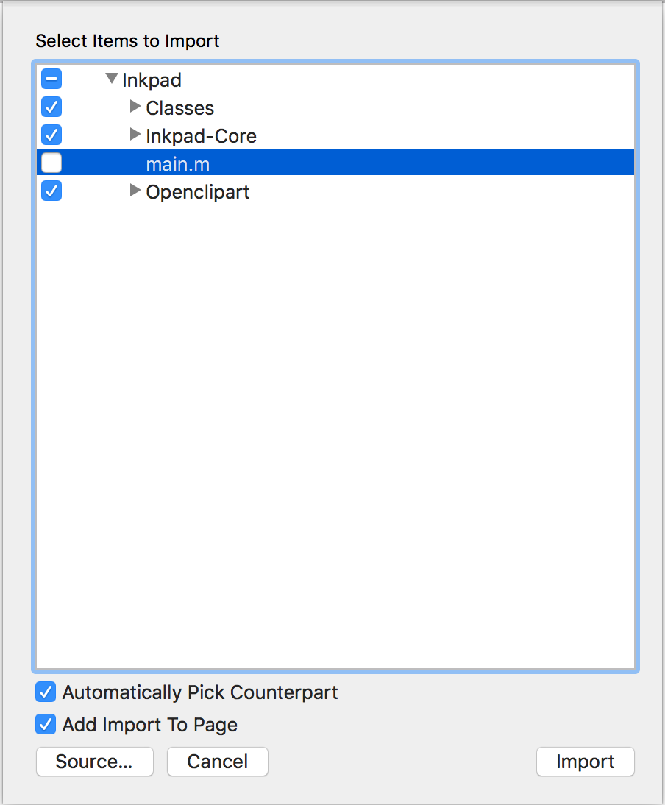

Depending on the size of the project this may take a little amount of time. DevSketch is looking for connections between all the objects. Go and grab a coffee. 

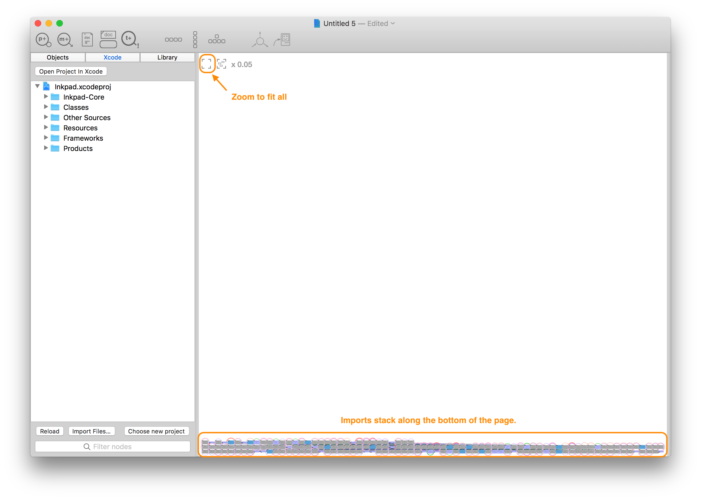

You can hit the zoom to display all button to show all the objects. They will be stacked along the bottom of the page.

### Analysing a project

You may want to find out somethings about a codebase before you start to work on it. 

Most iOS projects have some *UIViewController* instances. Open the library tab. 

1. Drag a *UIViewController* from the library to the map. 
2. Right-click and "Gather subclasses.

You can now see all the view controllers gathered in one place. 

*WDCanvasController* looks very bright on the heat map so you can bring it down to check out further. 

Zoom in (CMD+.) to reveal more information.

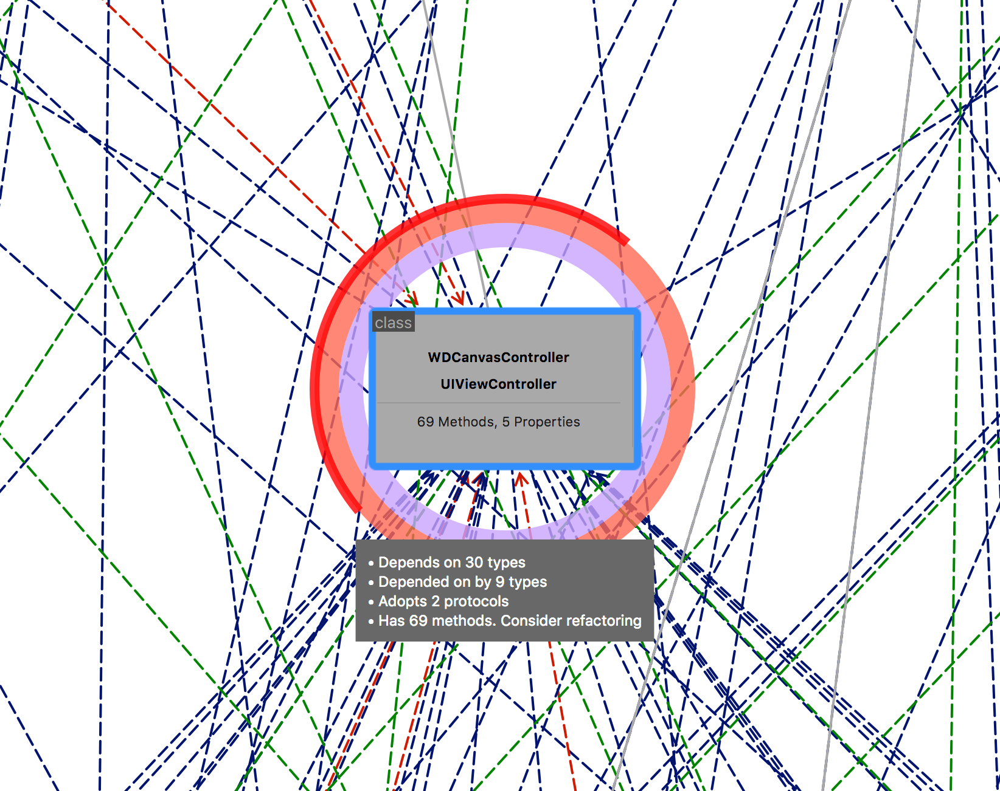

Move *WDCanvasController* to a blank space. 

Select **Object > Show all Related**. All the objects that depend on or are depended on by will arrange themselves nearby.

 
Three of the objects that *WDCanvasController* depends on seem to have a high density of links. 
 
Look at little closer at them. All three are heavily depended on. 

These files would be interesting places to start if you wanted to investigate the code base further. 

Also check out the classes that adopt *NSCoding*. These would be good places to start if you wanted to look at the archiving format. 

1. Find NSCoding in the object list. 
2. Drag it to the map. Dragging from the object list will reposition an object to its dropped location. You don't need to hunt it down on the map.
2. Object > Show all Related…

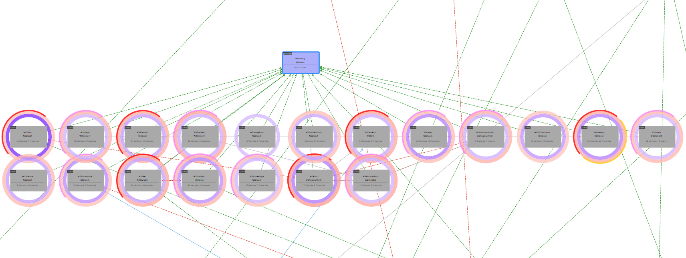

If the link drawing is confusing, you can switch off aspects in the **View menu**

- **Draw Dependancy Lines** controls all the *depends-on* relationship links.
- **Draw Only Coupled Objects** restricts dependancy drawing to objects that depend on each other. 
- **Draw Protocol Adoptions** controls links between Protocols and their adoptees. 
- **Draw Subclass lines** controls the links between Subclassed objects and also Extensions.
- **Hide Heat Map** prevents the heat map (circles) from being drawn.
- ** 

### Summary

Theres lots more you can do with the analysis. You don't have to have all objects on screen at once. Remember **Delete** to remove from map. **Alt+Delete** to really delete. 

